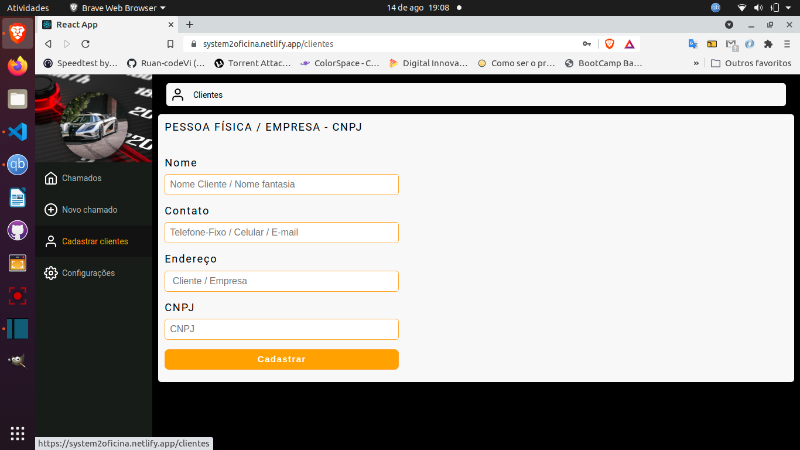
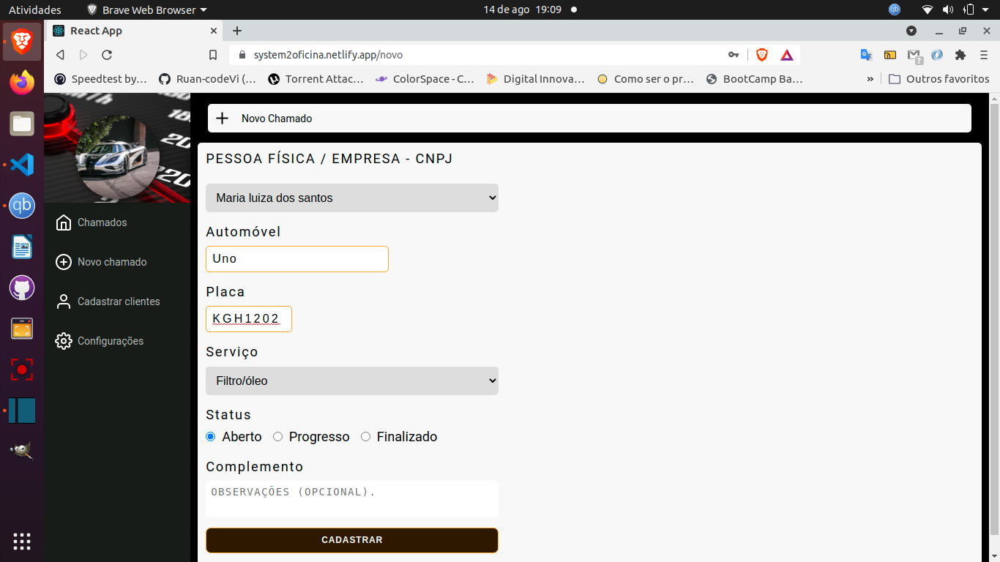
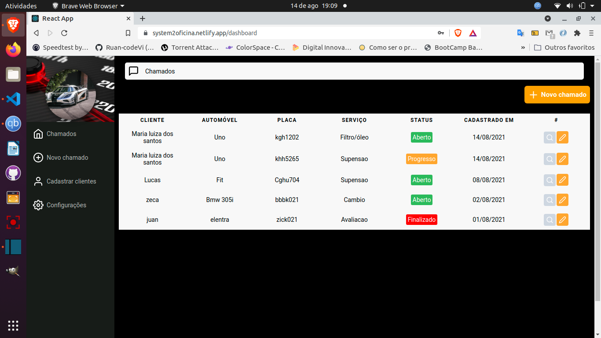

 

##  Description
Sistema dashboard para uma oficina de automóveis.

### Presentation
- State manegement no front-end feito com contextApi e React Hooks.
- Criação e validação através da próprias ferramentas Firebase.
 alterações ao Firebase e atualizando .
- Rota clientes, cadastro de cliente CPF ou CNPJ, cadastro do veiculo. 
- Rota chamado, cadastro de tipo de serviço a ser realizado no veiculo, status atual do chamado e opção de colocar ou não algum complemento nesse chamado.
- Rota Principal Dashbord contém cliente, auto(marca ou modelo), placa, tipo de serviço, status atual e data da criação do chamado,
nessa rota é possível visualizar infos de cada cliente e atualizar o tipo de serviço e o status.
---
## Screens

 
   
   

---
### Technologies
- React
- Node
- Firebase

# Getting Started with Create React App

This project was bootstrapped with [Create React App](https://github.com/facebook/create-react-app).

## Available Scripts

In the project directory, you can run:

### `yarn start`

Runs the app in the development mode.\
Open [http://localhost:3000](http://localhost:3000) to view it in the browser.

The page will reload if you make edits.\
You will also see any lint errors in the console.

### `yarn build`

Builds the app for production to the `build` folder.\
It correctly bundles React in production mode and optimizes the build for the best performance.

The build is minified and the filenames include the hashes.\
Your app is ready to be deployed!

See the section about [deployment](https://facebook.github.io/create-react-app/docs/deployment) for more information.

## Learn More

You can learn more in the [Create React App documentation](https://facebook.github.io/create-react-app/docs/getting-started).

To learn React, check out the [React documentation](https://reactjs.org/).

### Code Splitting

This section has moved here: [https://facebook.github.io/create-react-app/docs/code-splitting](https://facebook.github.io/create-react-app/docs/code-splitting)

### Analyzing the Bundle Size

This section has moved here: [https://facebook.github.io/create-react-app/docs/analyzing-the-bundle-size](https://facebook.github.io/create-react-app/docs/analyzing-the-bundle-size)

### Making a Progressive Web App

This section has moved here: [https://facebook.github.io/create-react-app/docs/making-a-progressive-web-app](https://facebook.github.io/create-react-app/docs/making-a-progressive-web-app)

### Deployment

This section has moved here: [https://facebook.github.io/create-react-app/docs/deployment](https://facebook.github.io/create-react-app/docs/deployment)

### `yarn build` fails to minify

This section has moved here: [https://facebook.github.io/create-react-app/docs/troubleshooting#npm-run-build-fails-to-minify](https://facebook.github.io/create-react-app/docs/troubleshooting#npm-run-build-fails-to-minify)
